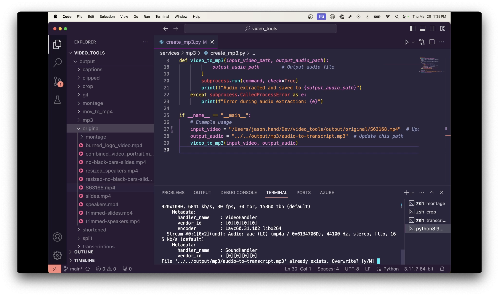

# Using the tools to generate a summary of a video presentation

1. Extract audio from a video file using the [Mp3 - Video to MP3 Conversion Utility](/services/mp3/mp3_README.md) script.
2. Use the [Transcribe TXT - Generates (TXT) Transcription from Mp3](/services/transcribe/transcribeTXT_README.md) script to generate a transcription of the audio. This step can take a while to run.
3. Chunk the audio into smaller sizes to fit the submission size restrictions for ChatGPT using the [Chunk](/services/chunk/chunk_README.md) script.
4. Submit to ChatGPT4 in sections and request a summary of the transcript including key topics, takeaways, and interesting quotes.

## Video Walk through
The video below walks you through the steps above (until I hit a rate limit error for ChatGPT4). In less than 10 minutes you can have a full summary of any video.

---

## Results from ChatGPT 3.5
>NOTE: I often run into rate limits when using ChatGPT4 to summarize content. In some cases I have been able to submit the full transcript to ChatGPT3.5 and generate a decent summary. This video is an example of that. 

The transcript is a presentation by Clemont discussing Bayesian methods and their application at DataDog, particularly in the context of third-party monitoring. Clemont introduces himself as a data scientist at DataDog and provides background information about the company and its products. He outlines the agenda, which includes an explanation of Bayesian methods, their application in monitoring third-party services and APIs, discussion on hierarchical models, implementation details, and engineering aspects of the project.

Clemont begins with a hypothetical scenario involving a competitor spying on DataDog to estimate the total number of employees using different statistical methods, highlighting the advantages of Bayesian statistics over other approaches. He then delves into using Bayesian methods for third-party monitoring, framing it as a time series forecasting problem and explaining how Bayesian inference allows for robust estimation, especially with limited data.

He describes the process of using Bayesian methods to estimate error rates for individual customers and global error rates for third-party services like OpenAI. Clemont explains the Bayesian framework, including prior distributions, likelihoods, and posterior distributions, and demonstrates how to incorporate uncertainty into the estimates.

Additionally, he discusses the engineering side of the project, including data ingestion, model serving, and incident detection. Clemont concludes with a quote by George Box emphasizing the utility of models despite their imperfections and expresses gratitude to the teams involved in the project.

**Key Topics:**
1. Introduction to Bayesian methods
2. Application of Bayesian methods in third-party monitoring
3. Hierarchical models
4. Engineering implementation
5. Error rate estimation for individual customers and global services
6. Time series aggregation and incident detection

**Key Takeaways:**
1. Bayesian methods offer advantages in estimating parameters and uncertainty, especially with limited data.
2. Hierarchical models allow for estimation of error rates at both individual customer and global service levels.
3. Engineering aspects involve data ingestion, model serving, and incident detection.
4. Models, while imperfect, are useful for capturing incidents with confidence.

**Interesting Quotes:**
1. "All models are wrong but some are useful." - George Box
2. "Bayesian statistics, those models that are a bit more complex... we'll see why."
3. "The Bayesian estimate is way closer to the red number than to other methods."
4. "We've got estimate for each customer error rate and one estimate for the global error rate."
5. "The model is strong enough to be useful."

---

## Scripts used

1. **🎵 [Mp3 - Video to MP3 Conversion Utility](/services/mp3/mp3_README.md)**: Extracts audio from video files and saves it as high-quality MP3 files, useful for isolating audio tracks or creating transcripts.

2. **📝 [Transcribe TXT - Generates (TXT) Transcription from Mp3](/services/transcribe/transcribeTXT_README.md)**: Transcribes audio into written text with timestamps using OpenAI's Whisper model, ideal for generating accurate subtitles.

3. **📄 [Chunk](/services/chunk/chunk_README.md)**: chunks a large text file into smaller sections, each with a specified maximum number of tokens, and saves the output as a new text file.