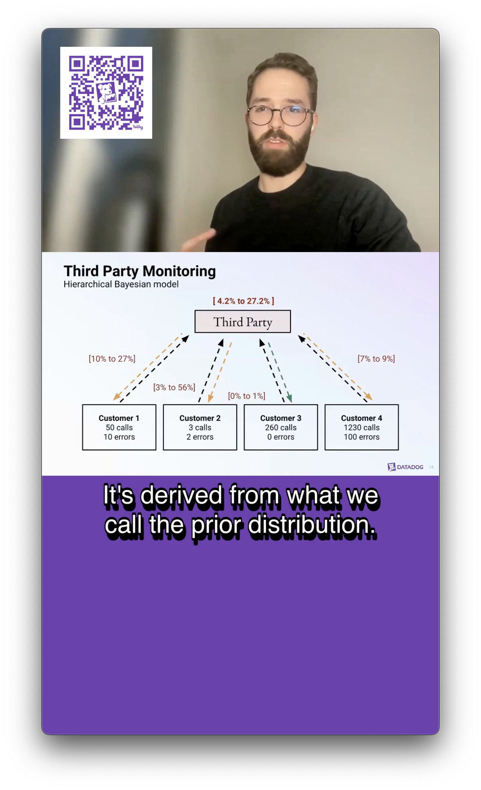

# Creating YouTube Shorts for Datadog On 

Following a [Datadog On episode](https://datadogon.datadoghq.com/episodes/datadog-on-data-science/) broadcast using Zoom, there are several video assets that are generated. Using 2 of these video assets, we can concactenate the speaker and slides into a single portrait format video.

## Steps

1. The slides video may contain black bars at the top and bottom of the output. These will need to be removed before merging the 2 videos. Use the **🔲 [Black_bars - Black Bar Removal](services/black_bars/black_bars_README.md)** script to accomplish this.

2. Next, you can use the **🖼 [Stacked - Portrait Stacked](services/stacked/stacked_README.md)** script to merge both videos with the speaker above the slides in a portrait format

3. Using the **📌 [Splitter - Video Clip Processor](services/splitter/splitter_README.md)** script, generate multiple clips from the longer video to find the one you want. 

4. Now that you have the clip you want to share, we need to extract the audio and transcribe it. Use the **🎵 [Mp3 - Video to MP3 Conversion Utility](services/mp3/mp3_README.md)** script to create a `.mp3` of the audio for the clip.

5. Using the `.mp3`, generate a `.srt` transcript file for the clip using the **📝 [Transcribe SRT - Generates (SRT) Transcription from Mp3](services/transcribe/transcribeSRT_README.md)** script.

6. Burn in the captions from the `.srt` file using the **🔤 [Captions - Burning Captions into Video](services/captions/captions_README.md)** script.

7. Burning a logo or QR code can be accomplished using the **🖼️ [Burn Logo - Logo Overlay Utility](services/burn_logo/burn_logo_README.md)** script.

## Scripts Used In Each Step

1. **🔲 [Black_bars - Black Bar Removal](services/black_bars/black_bars_README.md)**: Efficiently removes black bars from videos, resizing and cropping to fit a specified resolution.

2. **🖼 [Stacked - Portrait Stacked](services/stacked/stacked_README.md)**: Combines speaker footage and slide content into a single portrait video, enhancing video presentations.

3. **📌 [Splitter - Video Clip Processor](services/splitter/splitter_README.md)**: Generates multiple clips from a single video, adding consistent graphical overlays to each snippet.

4. **🎵 [Mp3 - Video to MP3 Conversion Utility](services/mp3/mp3_README.md)**: Extracts audio from video files and saves it as high-quality MP3 files, useful for isolating audio tracks or creating transcripts.

5. **📝 [Transcribe SRT - Generates (SRT) Transcription from Mp3](services/transcribe/transcribeSRT_README.md)**: Transcribes audio into written text with timestamps using OpenAI's Whisper model, ideal for generating accurate subtitles.

6. **🔤 [Captions - Burning Captions into Video](services/captions/captions_README.md)**: Burns subtitles from SRT files into videos, positioning them for better visibility and accessibility.

7. **🖼️ [Burn Logo - Logo Overlay Utility](services/burn_logo/burn_logo_README.md)**: Adds logos or watermarks to videos by overlaying images, with customizable positioning and sizing.
